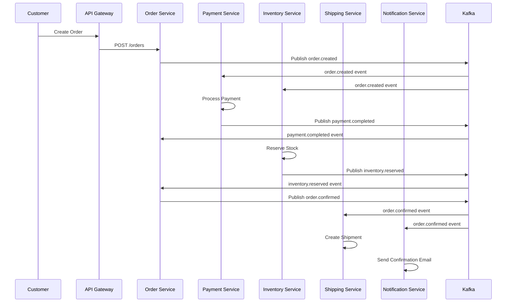

# 🏗️ E-Commerce Microservices Architecture

## 📋 **Core Principles**

### ✅ **Independence Requirements:**
1. **No Direct Dependencies** - Services cannot directly import or depend on each other
2. **Separate Databases** - Each service has its own database/schema
3. **Independent Deployment** - Each service can be deployed separately
4. **API Communication Only** - Services communicate via REST APIs or events
5. **Event-Driven Architecture** - Async communication through Kafka
6. **Shared Nothing** - No shared libraries or direct database access

---

## 🎯 **Service Communication Patterns**

### **1. Synchronous Communication (REST APIs)**
```
┌─────────────┐    HTTP/REST    ┌─────────────┐
│   Service A │ ──────────────► │   Service B │
│             │ ◄────────────── │             │
└─────────────┘                 └─────────────┘
```

### **2. Asynchronous Communication (Events)**
```
┌─────────────┐    Kafka Event   ┌─────────────┐
│   Service A │ ──────────────► │    Kafka    │
└─────────────┘                 │   Broker    │
                                │             │
┌─────────────┐                 │             │
│   Service B │ ◄────────────── │             │
└─────────────┘                 └─────────────┘
```

---

## 🗄️ **Database Per Service**

| Service | Database | Schema/Collection | Purpose |
|---------|----------|-------------------|---------|
| **Auth Service** | PostgreSQL | `auth_db` | Users, roles, sessions |
| **User Service** | PostgreSQL | `user_db` | Profiles, addresses, preferences |
| **Product Service** | PostgreSQL + Elasticsearch | `product_db` | Products, categories, search |
| **Cart Service** | Redis | `cart_db` | Shopping carts, saved items |
| **Order Service** | PostgreSQL + MongoDB | `order_db` | Orders, order history |
| **Payment Service** | PostgreSQL | `payment_db` | Payments, transactions |
| **Inventory Service** | PostgreSQL | `inventory_db` | Stock, reservations |
| **Shipping Service** | PostgreSQL | `shipping_db` | Shipments, tracking |
| **Promotion Service** | PostgreSQL + Redis | `promotion_db` | Coupons, discounts |
| **Review Service** | MongoDB | `review_db` | Reviews, ratings |
| **Notification Service** | PostgreSQL | `notification_db` | Messages, templates |
| **Admin Service** | PostgreSQL | `admin_db` | Admin operations |

---

## 📡 **API Communication Matrix**

### **Synchronous API Calls (REST)**

| From Service | To Service | Purpose | Endpoint Example |
|--------------|------------|---------|------------------|
| **API Gateway** | All Services | Route requests | `GET /api/v1/{service}/{endpoint}` |
| **Order Service** | **User Service** | Get user details | `GET /api/v1/users/{userId}` |
| **Order Service** | **Product Service** | Validate products | `GET /api/v1/products/{productId}` |
| **Order Service** | **Inventory Service** | Check stock | `GET /api/v1/inventory/{productId}/stock` |
| **Order Service** | **Payment Service** | Process payment | `POST /api/v1/payments` |
| **Cart Service** | **Product Service** | Get product info | `GET /api/v1/products/{productId}` |
| **Shipping Service** | **Order Service** | Get order details | `GET /api/v1/orders/{orderId}` |

### **Asynchronous Events (Kafka)**

| Publisher | Event Topic | Subscribers | Event Data |
|-----------|-------------|-------------|------------|
| **Auth Service** | `user.registered` | User Service, Notification Service | `{userId, email, timestamp}` |
| **User Service** | `user.profile.updated` | Order Service, Notification Service | `{userId, profile, timestamp}` |
| **Order Service** | `order.created` | Inventory, Payment, Shipping, Notification | `{orderId, userId, items, amount}` |
| **Order Service** | `order.confirmed` | Inventory, Shipping, Notification | `{orderId, status, timestamp}` |
| **Payment Service** | `payment.completed` | Order Service, Notification Service | `{paymentId, orderId, amount}` |
| **Payment Service** | `payment.failed` | Order Service, Notification Service | `{paymentId, orderId, reason}` |
| **Inventory Service** | `inventory.low_stock` | Product Service, Notification Service | `{productId, currentStock, threshold}` |
| **Shipping Service** | `shipment.delivered` | Order Service, Notification Service | `{shipmentId, orderId, timestamp}` |

---

## 🔄 **Event-Driven Workflows**

### **Order Processing Flow**


---

## 🛡️ **Service Independence Patterns**

### **1. Database Per Service**
```yaml
# Each service has its own database
auth-service:
  database: postgresql://auth_db
  
user-service:
  database: postgresql://user_db
  
product-service:
  database: postgresql://product_db
  search: elasticsearch://products_index
```

### **2. API Contracts**
```typescript
// Each service exposes well-defined APIs
interface UserServiceAPI {
  getUser(userId: string): Promise<User>;
  updateUser(userId: string, data: UserUpdate): Promise<User>;
}

interface ProductServiceAPI {
  getProduct(productId: string): Promise<Product>;
  searchProducts(query: SearchQuery): Promise<Product[]>;
}
```

### **3. Event Schemas**
```typescript
// Standardized event schemas
interface OrderCreatedEvent {
  eventType: 'order.created';
  orderId: string;
  userId: string;
  items: OrderItem[];
  totalAmount: number;
  timestamp: string;
}

interface PaymentCompletedEvent {
  eventType: 'payment.completed';
  paymentId: string;
  orderId: string;
  amount: number;
  timestamp: string;
}
```

---

## 🚀 **Independent Deployment Strategy**

### **Docker Compose Per Service**
```yaml
# Each service has its own docker-compose.yml
version: '3.8'
services:
  user-service:
    build: .
    environment:
      - DATABASE_URL=postgresql://user_db
      - KAFKA_BROKERS=kafka:9092
      - API_GATEWAY_URL=http://api-gateway:3000
    depends_on:
      - user-db
    networks:
      - ecommerce-network

  user-db:
    image: postgres:15
    environment:
      POSTGRES_DB: user_db
```

### **Kubernetes Deployment**
```yaml
# Each service has its own k8s manifests
apiVersion: apps/v1
kind: Deployment
metadata:
  name: user-service
spec:
  replicas: 3
  selector:
    matchLabels:
      app: user-service
  template:
    spec:
      containers:
      - name: user-service
        image: ecommerce/user-service:latest
        env:
        - name: DATABASE_URL
          valueFrom:
            secretKeyRef:
              name: user-service-secrets
              key: database-url
```

---

## 🔗 **Service Discovery & Communication**

### **Service Registry Pattern**
```typescript
// Service registry for dynamic discovery
class ServiceRegistry {
  private services = new Map<string, ServiceInfo>();
  
  register(serviceName: string, info: ServiceInfo) {
    this.services.set(serviceName, info);
  }
  
  discover(serviceName: string): ServiceInfo | null {
    return this.services.get(serviceName) || null;
  }
}
```

### **Circuit Breaker Pattern**
```typescript
// Prevent cascade failures
class CircuitBreaker {
  private failureCount = 0;
  private state: 'CLOSED' | 'OPEN' | 'HALF_OPEN' = 'CLOSED';
  
  async call<T>(fn: () => Promise<T>): Promise<T> {
    if (this.state === 'OPEN') {
      throw new Error('Circuit breaker is OPEN');
    }
    
    try {
      const result = await fn();
      this.onSuccess();
      return result;
    } catch (error) {
      this.onFailure();
      throw error;
    }
  }
}
```

---

## 📊 **Data Consistency Patterns**

### **1. Eventual Consistency**
- Services maintain their own data
- Synchronization through events
- Accept temporary inconsistency

### **2. Saga Pattern**
```typescript
// Distributed transaction management
class OrderSaga {
  async execute(orderData: OrderData) {
    try {
      // Step 1: Create order
      const order = await this.createOrder(orderData);
      
      // Step 2: Process payment
      const payment = await this.processPayment(order);
      
      // Step 3: Reserve inventory
      const reservation = await this.reserveInventory(order);
      
      // Step 4: Create shipment
      const shipment = await this.createShipment(order);
      
    } catch (error) {
      // Compensating actions
      await this.compensate(error);
    }
  }
}
```

### **3. CQRS (Command Query Responsibility Segregation)**
```typescript
// Separate read and write models
class OrderCommandService {
  async createOrder(command: CreateOrderCommand): Promise<void> {
    // Write operations
  }
}

class OrderQueryService {
  async getOrder(orderId: string): Promise<OrderView> {
    // Read operations
  }
}
```

---

## 🛠️ **Development Guidelines**

### **Service Development Rules:**
1. ✅ **Own Database**: Each service manages its own data
2. ✅ **API First**: Define APIs before implementation
3. ✅ **Event Publishing**: Publish events for state changes
4. ✅ **Idempotent Operations**: Handle duplicate requests
5. ✅ **Health Checks**: Implement health endpoints
6. ✅ **Graceful Shutdown**: Handle shutdown signals
7. ✅ **Configuration**: Externalize all configuration
8. ✅ **Logging**: Structured logging with correlation IDs

### **Forbidden Patterns:**
1. ❌ **Direct Database Access**: Never access another service's database
2. ❌ **Shared Libraries**: No shared business logic libraries
3. ❌ **Synchronous Chains**: Avoid long chains of API calls
4. ❌ **Distributed Transactions**: No 2PC or distributed locks
5. ❌ **Shared State**: No shared memory or global variables

---

## 🔍 **Monitoring & Observability**

### **Distributed Tracing**
```typescript
// Correlation IDs for request tracing
class RequestTracer {
  static generateCorrelationId(): string {
    return `trace-${Date.now()}-${Math.random()}`;
  }
  
  static addTraceHeaders(headers: Headers, correlationId: string) {
    headers.set('X-Correlation-ID', correlationId);
    headers.set('X-Trace-ID', correlationId);
  }
}
```

### **Service Metrics**
- Request/response times
- Error rates
- Throughput
- Resource utilization
- Business metrics

---

## 🎯 **Benefits of This Architecture**

1. **Independent Scaling**: Scale services based on demand
2. **Technology Diversity**: Use best technology for each service
3. **Fault Isolation**: Failures don't cascade
4. **Team Autonomy**: Teams can work independently
5. **Continuous Deployment**: Deploy services independently
6. **Maintainability**: Smaller, focused codebases

This architecture ensures true microservices independence while maintaining system cohesion through well-defined APIs and event-driven communication.
