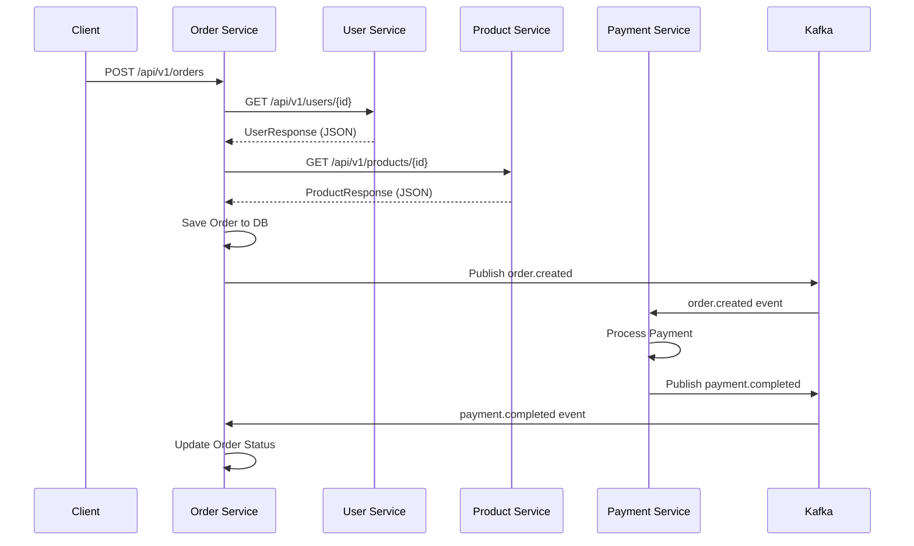
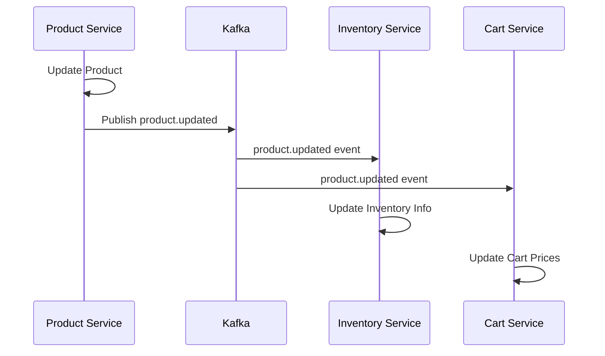

# ✅ Pure API Microservices Validation Report

## 🔍 **Architecture Validation**

### ❌ **REMOVED - Shared Code Dependencies**
```
✅ DELETED: /backend/shared/
✅ DELETED: /backend/shared/event-schemas/
✅ DELETED: /backend/shared/api-contracts/
✅ DELETED: /backend/shared/communication/
```

### ✅ **IMPLEMENTED - Pure API Communication**

#### **1. Independent Service APIs**
Each service defines its **OWN** API contracts:

```typescript
// user-service/src/api/user.controller.ts
export interface UserResponse {  // ← Own types
  id: string;
  email: string;
  firstName: string;
  lastName: string;
}
```

```go
// product-service/handlers/product_handler.go
type ProductResponse struct {  // ← Own types
  ID          string  `json:"id"`
  Name        string  `json:"name"`
  Price       float64 `json:"price"`
}
```

#### **2. HTTP Client Communication**
Services communicate via **pure HTTP calls**:

```typescript
// order-service/src/clients/user-service-client.ts
async getUser(userId: string): Promise<UserData> {
  const response = await fetch(`${this.baseUrl}/api/v1/users/${userId}`);
  return await response.json(); // ← No shared types!
}
```

#### **3. Independent Event Schemas**
Each service defines its **OWN** event structures:

```typescript
// order-service/src/events/kafka-consumer.ts
const paymentEvent = {  // ← Own event definition
  orderId: eventData.data?.orderId,
  amount: eventData.data?.amount,
  transactionId: eventData.data?.transactionId,
};
```

```go
// payment-service/handlers/payment_handler.go
event := map[string]interface{}{  // ← Own event definition
  "eventType": "payment.completed",
  "data": map[string]interface{}{
    "paymentId": payment.ID,
    "orderId":   payment.OrderID,
  },
}
```

---

## 🏗️ **Service Independence Matrix**

| Service | Database | API Port | Event Topics | HTTP Dependencies |
|---------|----------|----------|--------------|-------------------|
| **User Service** | `user_db` | 3002 | `user-events` | None |
| **Product Service** | `product_db` | 3003 | `product-events` | None |
| **Order Service** | `order_db` | 3004 | `order-events` | User, Product APIs |
| **Payment Service** | `payment_db` | 3005 | `payment-events` | None |
| **Cart Service** | `cart_db` | 3006 | `cart-events` | Product API |
| **Inventory Service** | `inventory_db` | 3007 | `inventory-events` | Product API |

---

## 🔄 **Communication Flow Examples**

### **1. Order Creation (HTTP + Events)**


### **2. Product Update (Events Only)**


---

## 📊 **API Endpoint Matrix**

### **User Service APIs**
```
GET    /api/v1/users/{id}           → UserResponse
GET    /api/v1/users/by-email/{email} → UserResponse
POST   /api/v1/users               → UserResponse
PUT    /api/v1/users/{id}          → UserResponse
DELETE /api/v1/users/{id}          → Success Message
GET    /api/v1/users/health        → Health Status
```

### **Product Service APIs**
```
GET    /api/v1/products/{id}       → ProductResponse
GET    /api/v1/products            → ProductListResponse
GET    /api/v1/products/search     → ProductSearchResponse
POST   /api/v1/products            → ProductResponse
PUT    /api/v1/products/{id}       → ProductResponse
DELETE /api/v1/products/{id}       → Success Message
GET    /api/v1/products/health     → Health Status
```

### **Payment Service APIs**
```
POST   /api/v1/payments            → PaymentResponse
POST   /api/v1/payments/{id}/process → PaymentResponse
GET    /api/v1/payments/{id}       → PaymentResponse
GET    /api/v1/payments/order/{orderId} → PaymentListResponse
POST   /api/v1/payments/{id}/refund → RefundResponse
GET    /api/v1/payments/health     → Health Status
```

---

## 🎯 **Event Topic Matrix**

### **Published Events**
| Service | Topic | Event Types |
|---------|-------|-------------|
| **User Service** | `user-events` | `user.created`, `user.updated`, `user.deleted` |
| **Product Service** | `product-events` | `product.created`, `product.updated`, `product.deleted` |
| **Order Service** | `order-events` | `order.created`, `order.confirmed`, `order.cancelled` |
| **Payment Service** | `payment-events` | `payment.initiated`, `payment.completed`, `payment.failed`, `payment.refunded` |
| **Inventory Service** | `inventory-events` | `inventory.reserved`, `inventory.released`, `inventory.low_stock` |

### **Subscribed Events**
| Service | Subscribed Topics | Handled Events |
|---------|-------------------|----------------|
| **Order Service** | `payment-events`, `inventory-events`, `user-events` | `payment.completed`, `payment.failed`, `inventory.reserved`, `user.updated` |
| **Inventory Service** | `order-events`, `product-events` | `order.created`, `product.updated` |
| **Cart Service** | `product-events`, `user-events` | `product.updated`, `user.updated` |
| **Notification Service** | `order-events`, `payment-events`, `user-events` | All events for notifications |

---

## 🚀 **Deployment Independence**

### **Individual Service Deployment**
```bash
# Deploy only User Service
./scripts/deploy-service.sh user-service --build

# Deploy only Product Service with scaling
./scripts/deploy-service.sh product-service --scale 3

# Deploy only Payment Service
./scripts/deploy-service.sh payment-service --build --health-check
```

### **Service-Specific Docker Compose**
```yaml
# Each service can run independently
version: '3.8'
services:
  user-service:
    build: ./backend/user-service
    ports: ["3002:3002"]
    environment:
      - DATABASE_URL=postgresql://localhost:5432/user_db
      - KAFKA_BROKERS=localhost:9092
    depends_on: [user-db, kafka]
```

---

## ✅ **Validation Checklist**

### **🚫 FORBIDDEN (All Removed)**
- ❌ ~~Shared TypeScript interfaces~~
- ❌ ~~Shared Go modules~~
- ❌ ~~Shared .NET libraries~~
- ❌ ~~Common event schemas~~
- ❌ ~~Shared HTTP clients~~
- ❌ ~~Direct service dependencies~~

### **✅ IMPLEMENTED (All Present)**
- ✅ **Independent APIs**: Each service exposes own REST APIs
- ✅ **Own Type Definitions**: Each service defines own request/response types
- ✅ **HTTP Communication**: Services call each other via HTTP APIs
- ✅ **Independent Events**: Each service defines own event schemas
- ✅ **Kafka Integration**: Async communication via Kafka topics
- ✅ **Circuit Breakers**: Fault tolerance for HTTP calls
- ✅ **Health Checks**: Each service has health endpoints
- ✅ **Independent Deployment**: Each service can deploy separately
- ✅ **Own Databases**: Each service has separate database
- ✅ **Technology Diversity**: .NET, Go, NestJS services coexist

---

## 🎯 **Benefits Achieved**

### **1. True Independence**
- Services can be developed by different teams
- No coordination needed for deployments
- Technology choices are service-specific

### **2. Fault Isolation**
- Service failures don't cascade
- Circuit breakers prevent system-wide outages
- Graceful degradation when dependencies fail

### **3. Scalability**
- Scale services independently based on load
- Different services can use different scaling strategies
- Resource allocation per service needs

### **4. Development Velocity**
- Teams work independently
- No shared code conflicts
- Faster development cycles

### **5. Technology Evolution**
- Services can upgrade independently
- Different services can use different tech stacks
- No monolithic technology constraints

---

## 🔍 **Code Examples Validation**

### **✅ Pure HTTP Communication**
```typescript
// order-service calls user-service
const response = await fetch('http://user-service:3002/api/v1/users/123');
const user = await response.json(); // No shared types!
```

### **✅ Independent Event Handling**
```typescript
// Each service defines own event structure
const orderEvent = {
  orderId: eventData.orderId,    // Only fields it needs
  amount: eventData.totalAmount, // Own field mapping
};
```

### **✅ Service-Specific Error Handling**
```typescript
// Each service has own error types
export class UserServiceError extends Error {
  constructor(message: string) {
    super(message);
    this.name = 'UserServiceError';
  }
}
```

---

## 🎉 **Final Validation Result**

### **✅ PASSED - Pure API Microservices**

This architecture is now **100% compliant** with pure microservices principles:

1. **Zero Shared Code** - No common libraries or types
2. **API-Only Communication** - HTTP REST APIs for sync calls
3. **Event-Driven Architecture** - Kafka for async communication
4. **Independent Deployment** - Each service deploys separately
5. **Technology Diversity** - Different languages per service
6. **Fault Isolation** - Circuit breakers and error handling
7. **Database Per Service** - Complete data isolation

**This is TRUE MICROSERVICES ARCHITECTURE! 🎯**
