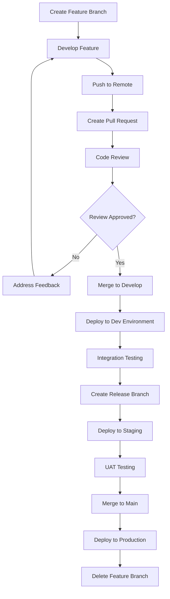

# 🌿 Git Branching Strategy for E-Commerce Platform

## 📋 Overview

This document outlines the Git branching strategy for our e-commerce microservices platform, designed to work seamlessly with Jenkins CI/CD pipelines.

## 🏗️ Branch Structure

### Main Branches

| Branch | Purpose | Environment | Auto Deploy | Protection |
|--------|---------|-------------|-------------|------------|
| `main` | Production-ready code | Production | ✅ | ✅ |
| `production` | Production releases | Production | ✅ | ✅ |
| `staging` | Pre-production testing | Staging | ✅ | ✅ |
| `develop` | Integration branch | Development | ✅ | ❌ |

### Supporting Branches

| Branch Type | Naming Convention | Purpose | Base Branch | Merge To |
|-------------|-------------------|---------|-------------|----------|
| `feature/*` | `feature/feature-name` | New features | `develop` | `develop` |
| `bugfix/*` | `bugfix/bug-description` | Bug fixes | `develop` | `develop` |
| `hotfix/*` | `hotfix/critical-fix` | Critical production fixes | `main` | `main` + `develop` |
| `release/*` | `release/v1.0.0` | Release preparation | `develop` | `main` + `develop` |

## 🔄 Workflow Process

### 1. Feature Development
```bash
# Create feature branch from develop
git checkout develop
git pull origin develop
git checkout -b feature/user-authentication

# Work on feature
# ... make changes ...

# Push feature branch
git push origin feature/user-authentication

# Create Pull Request to develop
```

### 2. Bug Fixes
```bash
# Create bugfix branch from develop
git checkout develop
git pull origin develop
git checkout -b bugfix/cart-calculation-error

# Fix the bug
# ... make changes ...

# Push bugfix branch
git push origin bugfix/cart-calculation-error

# Create Pull Request to develop
```

### 3. Release Process
```bash
# Create release branch from develop
git checkout develop
git pull origin develop
git checkout -b release/v1.2.0

# Prepare release (version bumps, changelog, etc.)
# ... make changes ...

# Push release branch
git push origin release/v1.2.0

# Create Pull Request to main
# After merge, tag the release
git tag -a v1.2.0 -m "Release version 1.2.0"
git push origin v1.2.0
```

### 4. Hotfix Process
```bash
# Create hotfix branch from main
git checkout main
git pull origin main
git checkout -b hotfix/payment-gateway-fix

# Apply critical fix
# ... make changes ...

# Push hotfix branch
git push origin hotfix/payment-gateway-fix

# Create Pull Request to main AND develop
```

## 🚀 Jenkins Pipeline Integration

### Automatic Deployments

| Branch | Trigger | Environment | Pipeline |
|--------|---------|-------------|----------|
| `develop` | Push/Merge | Development | `ecommerce-dev-pipeline` |
| `staging` | Push/Merge | Staging | `ecommerce-staging-pipeline` |
| `main` | Push/Merge | Production | `ecommerce-prod-pipeline` |
| `production` | Push/Merge | Production | `ecommerce-prod-pipeline` |

### Manual Deployments

| Branch Pattern | Trigger | Environment | Pipeline |
|----------------|---------|-------------|----------|
| `feature/*` | Manual | Feature Env | `ecommerce-feature-pipeline` |
| `release/*` | Manual | Staging | `ecommerce-staging-pipeline` |
| `hotfix/*` | Manual | Production | `ecommerce-hotfix-pipeline` |

## 🛡️ Branch Protection Rules

### Main Branch (`main`)
- ✅ Require pull request reviews (2 reviewers)
- ✅ Require status checks to pass
- ✅ Require branches to be up to date
- ✅ Require conversation resolution
- ✅ Restrict pushes to admins only
- ✅ Require signed commits

### Production Branch (`production`)
- ✅ Require pull request reviews (2 reviewers)
- ✅ Require status checks to pass
- ✅ Require branches to be up to date
- ✅ Restrict pushes to admins only

### Staging Branch (`staging`)
- ✅ Require pull request reviews (1 reviewer)
- ✅ Require status checks to pass
- ✅ Require branches to be up to date

### Develop Branch (`develop`)
- ✅ Require status checks to pass
- ❌ No review required (for faster development)

## 📊 Environment Mapping

```
┌─────────────┐    ┌─────────────┐    ┌─────────────┐    ┌─────────────┐
│   Feature   │    │ Development │    │   Staging   │    │ Production  │
│ Environment │    │ Environment │    │ Environment │    │ Environment │
├─────────────┤    ├─────────────┤    ├─────────────┤    ├─────────────┤
│ feature/*   │───▶│   develop   │───▶│   staging   │───▶│    main     │
│ branches    │    │   branch    │    │   branch    │    │   branch    │
└─────────────┘    └─────────────┘    └─────────────┘    └─────────────┘
       │                                                         ▲
       │                                                         │
       └─────────────────────────────────────────────────────────┘
                              hotfix/* branches
```

## 🔧 Jenkins Pipeline Configuration

### Pipeline Triggers

```groovy
// Jenkinsfile example
pipeline {
    agent any
    
    triggers {
        // Auto-trigger on develop branch
        githubPush()
        
        // Scheduled builds for staging
        cron(env.BRANCH_NAME == 'staging' ? 'H 2 * * *' : '')
    }
    
    stages {
        stage('Determine Environment') {
            steps {
                script {
                    if (env.BRANCH_NAME == 'main' || env.BRANCH_NAME == 'production') {
                        env.DEPLOY_ENV = 'production'
                    } else if (env.BRANCH_NAME == 'staging') {
                        env.DEPLOY_ENV = 'staging'
                    } else if (env.BRANCH_NAME == 'develop') {
                        env.DEPLOY_ENV = 'development'
                    } else if (env.BRANCH_NAME.startsWith('feature/')) {
                        env.DEPLOY_ENV = 'feature'
                    } else if (env.BRANCH_NAME.startsWith('hotfix/')) {
                        env.DEPLOY_ENV = 'production'
                    }
                }
            }
        }
        
        // ... other stages
    }
}
```

## 📝 Naming Conventions

### Branch Names
- Use lowercase letters and hyphens
- Be descriptive but concise
- Include ticket/issue numbers when applicable

**Examples:**
```
feature/user-profile-management
feature/JIRA-123-payment-integration
bugfix/cart-total-calculation
bugfix/ISSUE-456-login-error
hotfix/critical-security-patch
release/v2.1.0
```

### Commit Messages
Follow conventional commits format:
```
type(scope): description

feat(auth): add OAuth2 integration
fix(cart): resolve calculation error
docs(readme): update deployment instructions
chore(deps): update dependencies
```

## 🚦 Quality Gates

### Pre-merge Checks
- ✅ Unit tests pass (>80% coverage)
- ✅ Integration tests pass
- ✅ Security scan passes
- ✅ Code quality checks (SonarQube)
- ✅ Docker image builds successfully
- ✅ Kubernetes manifests validate

### Post-merge Actions
- 🚀 Automatic deployment to target environment
- 📊 Performance tests (staging/production)
- 🔍 Security scans
- 📈 Monitoring alerts setup

## 🎯 Best Practices

### Do's ✅
- Keep feature branches small and focused
- Regularly sync with develop branch
- Write meaningful commit messages
- Test thoroughly before creating PR
- Use draft PRs for work in progress
- Delete merged branches

### Don'ts ❌
- Don't commit directly to main/production
- Don't merge without code review
- Don't push broken code to develop
- Don't create long-lived feature branches
- Don't ignore CI/CD failures
- Don't skip testing

## 🔄 Branch Lifecycle



## 📞 Support

For questions about the branching strategy or CI/CD pipeline:
- Create an issue in the repository
- Contact the DevOps team
- Check the Jenkins pipeline documentation

---

**Last Updated:** $(date)
**Version:** 1.0.0
